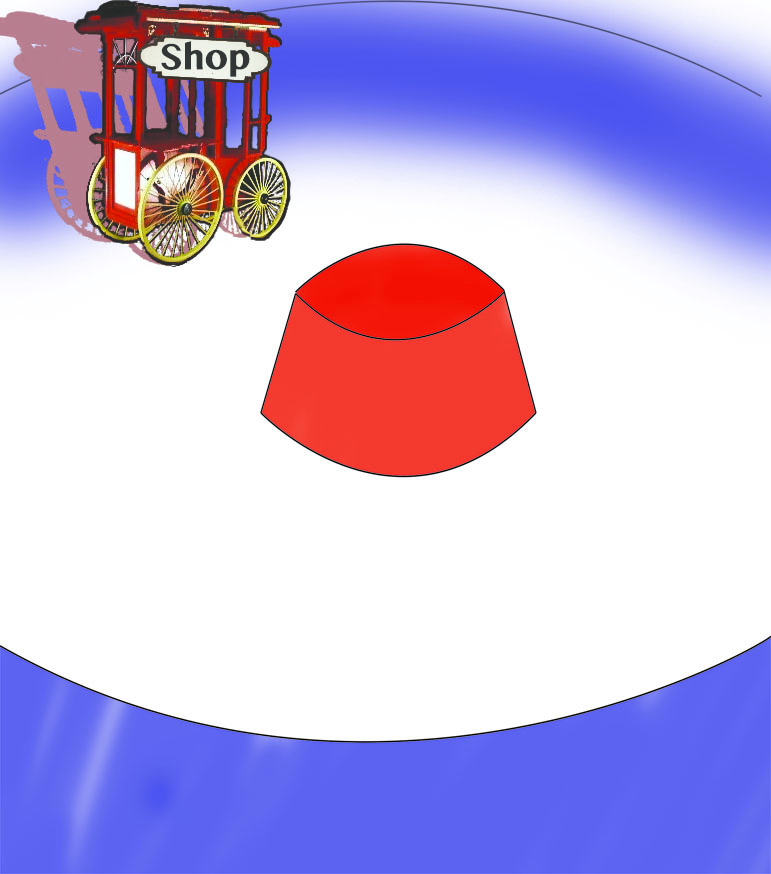

# Cocos2d for Xamarin

## Seal game

This is going to be a 2d platform game. The goal is to avoid balls and ice bears in order to escape from a circus. It`s a game with no end. Pictures are comming.

## Menu

For my Seal-game I wanted a menu looking like a Circus, where the buttons were circus objects.

Example: ( **Shop** )

<label for="name" align:"middle"  id="name_label">Normal state:</label>


<label for="name" align:"middle"  id="name_label">Clicked state:</label>


Add images to your Content folder and add code to load the images as Selected- and normal-image of a button.
```csharp
ShopButton = new CCMenuItemImage ();
ShopButton.NormalImage = new CCSprite ("circusshop");
ShopButton.SelectedImage = new CCSprite ("clickedcircusshop");
```

Next is the handling of clicks:
```csharp
ShopButton.Target = OpenShop;
//----
private void OpenShop(Object c){
  var transition = new CCTransitionScene (0.1f, new ShopScene (Window));
  Window.DefaultDirector.ReplaceScene (transition);
}
```

### Positioning

Having buttons is nice and smooth, but placing them... Sometimes the tweaking takes forever. To make it easier I`m using Photoshop.

First off, I have to make my images the same scale making their photoshop size correspond with the size ingame.
My following action is to place them on the background using photoshop for the tweaking part. As an example:



Clicking the shop sprite in photosop and pressing cmd+T will show me the x and y coordinates of my image center which could be scaled down to match the game`s coordinates.

What`s missing? The definition of x:0, y:0.
This is different for photoshop and Xamarin. Creating a ``CCMenu`` and place your buttons on this will fix it.

```csharp
var menu = new CCMenu(new CCMenuItem[]{StartButton, SettingsButton, ShopButton});
menu.PositionY = 337;
menu.PositionX = 0;
startLayer.AddChild (menu);
```

Set X and Y of your buttons and youre done!

```csharp
ShopButton.Scale = 0.3f;
ShopButton.PositionX = 100;
ShopButton.PositionY = 120;
```

## Shop view

Now I´m going to learn how to make a shop like page with multiple scrollviews. First off I want to make scrolling horizontaly possible. Then I would like a vertical scroll for each group if there are more than 1 item.

This is going to come during the next 24 hours, I´ll just have to learn it first! =)
